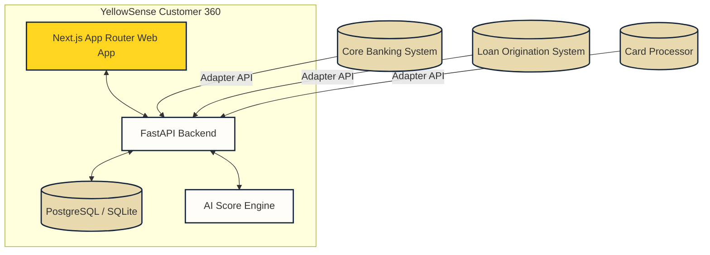

# YellowSense Customer 360 - Architecture Blueprint

This document describes the high-level architecture, design decisions, data model, and integration patterns for the YellowSense Customer 360 platform.

## System Context

YellowSense Customer 360 acts as a unified intelligence and orchestration layer above the bank's core transactional systems. It aggregates customer data from multiple sources (Core Banking, Loan Origination, Cards, UPI, Deposits) to present a consolidated, real-time view of customer relationships.

---

## Data Model

The platform uses a relational schema. Below is a summary of the core entities and their relationships.

### User
Represents a banking employee.
- `id` (UUID): Primary key.
- `employee_id` (VARCHAR): Unique employee identifier (e.g. `EMP101`).
- `name` (VARCHAR): Full name of the employee.
- `email` (VARCHAR): Work email address.
- `role` (VARCHAR): One of `ZRT_OFFICER`, `RM`, `VRM`, `BRANCH_MANAGER`, `REGIONAL_MANAGER`, `HEAD_OFFICE`, `ADMIN`.
- `branch_id` (VARCHAR): Assigned branch identifier.
- `region_id` (VARCHAR): Assigned region identifier.
- `status` (VARCHAR): Active or Inactive.

### Customer
Core profile record representing a business or individual client.
- `id` (UUID): Primary key.
- `customer_number` (VARCHAR): Unique customer number.
- `full_name` (VARCHAR): Business or personal name.
- `customer_type` (VARCHAR): `INDIVIDUAL` or `CORPORATE`.
- `segment` (VARCHAR): `MSME`, `PREMIUM`, `RETAIL`, `EMERGING`.
- `lifecycle_stage` (VARCHAR): `PROSPECT`, `ONBOARDED`, `ACTIVE`, `CHURNED`, `DORMANT`.
- `mobile` (VARCHAR): Contact mobile number.
- `email` (VARCHAR): Contact email.
- `city` (VARCHAR) & `state` (VARCHAR): Geographical locations.
- `branch_id` (VARCHAR): Assigned branch location.
- `assigned_rm_id` (UUID): Foreign key referencing `User`.
- `assigned_vrm_id` (UUID): Foreign key referencing `User`.
- `relationship_value` (DECIMAL): Total relationship valuation in INR.
- `relationship_tenure_months` (INTEGER): Months with the bank.
- `digital_engagement_score` (INTEGER): score from $0-100$.
- `sentiment` (VARCHAR): `POSITIVE`, `NEUTRAL`, `NEGATIVE`.
- `churn_risk` (INTEGER): score from $0-100$.
- `lead_propensity` (INTEGER): score from $0-100$.

### Account & ProductHolding
Tracks active and historical accounts or products held by the customer.
- `Account`: balance, status, account number (masked in UI).
- `ProductHolding`: product name, type (e.g. `Current Account`, `POS Solution`), value.

### Visit & NeedAssessment
Simulates field mobilization workflows (ZRT Officers).
- `Visit`: check-in, check-out timestamps, GPS coordinates (latitude, longitude), geofence validation indicator, notes.
- `NeedAssessment`: Working capital needs, term loans, POS/QR systems, salary accounts, insurance.

### Lead & Opportunity
Enables customer growth tracking.
- `Lead`: stage (`New`, `Contacted`, `Qualified`, `Documents Pending`, `Application`, `Approved`, `Converted`, `Lost`), owner (RM), potential value.
- `Opportunity`: associated expected values, close dates, probability parameters.

### Meeting
Summarizes client relationship discussions.
- `Meeting`: transcripts, auto-generated summary, sentiment classification, task action items.

### Complaint & Query
Support ticket handling.
- `Complaint`: Category, severity, routing team, SLA timers, escalation levels.
- `Query`: Inbound text, intent matching, routed desk, status tracking.

### Consent
Audit logs capturing compliance with India's DPDP Act.
- `Consent`: opt-ins for specific channels (e.g., SMS, email), purpose flags, revoked timestamp, captured timestamp.

### AIRecommendation & AuditEvent
Provides explainable AI recommendations and full audit logging.
- `AIRecommendation`: Next Best Action (NBA), confidence, reason code lists, model versioning, employee decisions (accept, modify, dismiss).
- `AuditEvent`: audit logs tracking system changes (before/after states, actions, timestamps, and actor references).

---

## AI Score Engine & Abstractions

To enforce explainability, all AI outputs follow a strict format exposing contributing factors. The backend includes services in `api/app/ai/`:

1.  **Lead Scoring**: Computes a score from $0-100$ based on:
    $$\text{Score} = \text{engagement} \times 0.3 + \text{explicit\_need} \times 0.4 + \text{document\_readiness} \times 0.2 + \text{relationship} \times 0.1 - \text{penalties}$$
2.  **Next Best Action (NBA)**: A rules-based hybrid. It returns specific advice like:
    - `"Resolve open POS complaint before cross-selling"` if a severe complaint exists.
    - `"Prioritize service recovery outreach"` if churn risk is $>75\%$.

---

## Integration Adapter Pattern

Since the POC runs locally, integrations to Core Banking Systems (CBS) or Card Systems are simulated using adapters located under `api/app/integrations/`:
- `mock_cbs.py`: Simulates balances, accounts, and eligibility verification.
- `mock_los.py`: Simulates loan registration and updates.
- `mock_cards.py`: Simulates card activation and usage telemetry.

---

## POC vs. Production Boundaries

- **Database**: The POC uses PostgreSQL (inside Docker) or SQLite (locally). In production, this maps to an OLAP store (e.g. Apache Pinot / ClickHouse) populated via Change Data Capture (CDC) from the Core Banking database.
- **Workflow**: Stateful interactions are managed inside FastAPI. In production, these map to durable execution engines like Temporal.io.
- **AI**: The AI returns mock or rule-based outputs in default mode. In production, this routes to a secure enterprise model serving framework (e.g. Amazon Bedrock, Google Vertex AI) with local vector store context (RAG).
